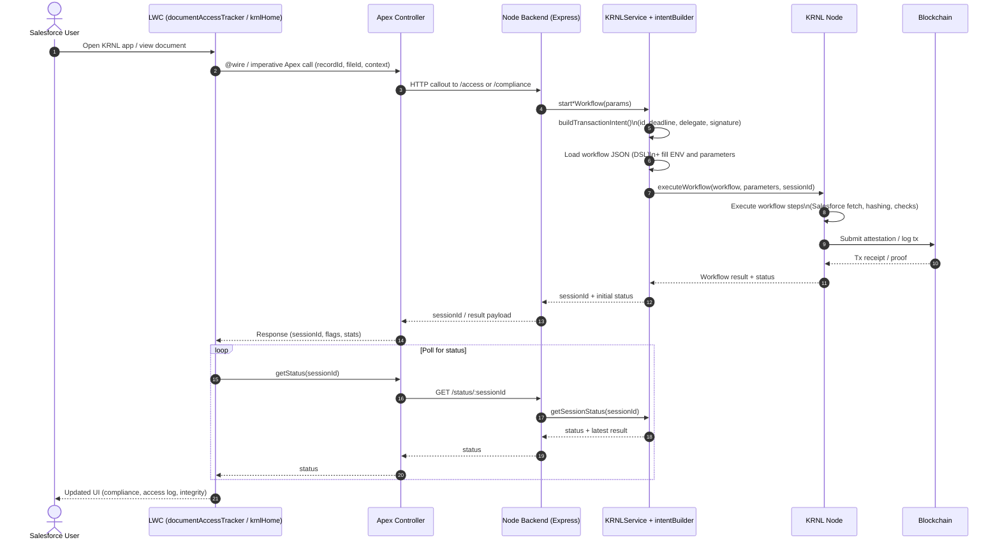

# KRNL Salesforce Integration

This repo contains an end‑to‑end integration between Salesforce (LWC + Apex), a Node.js backend, and the KRNL workflow engine running on a blockchain.

- Salesforce app (in `salesforce-krnl/`):
  - LWC components like `documentAccessTracker` and `krnlHome`.
  - Apex controllers that expose REST endpoints and call out to the backend.
- Backend (in `backend/`):
  - Express API controllers (e.g. `accessController`, `complianceController`).
  - `KRNLService` and `intentBuilder` that construct and submit KRNL workflows.
- Workflows (in `workflows/`):
  - KRNL workflow DSL JSON files for compliance checks, access logging, and document registration.
- Reference client / facilitator (root):
  - `client-eoa-eip4337.ts` (EOA + EIP‑4337 smart account client).
  - `facilitator/workflow-template.json` (workflow template used as a reference).

---

## High‑Level Flow (Mermaid Sequence Diagram)



This diagram represents any of the KRNL workflows (compliance check, access logging, integrity validation). They all follow the same pattern:

- LWC → Apex → Backend controller
- Backend controller → `KRNLService` → `intentBuilder` → KRNL Node
- KRNL Node → Blockchain → back to UI via polling.

### Session-first secure viewer & access history (overview)

For the **secure document viewer** and access history, the repo also implements a
"session-first" flow:

- When a user clicks **View** on a registered upload, Apex calls the backend
  `/api/access/init` endpoint.
- The backend starts a KRNL access-logging workflow and returns a **`sessionId`**
  plus a `/secure-viewer?sessionId=...` URL.
- Apex immediately creates a `Document_Access_Log__c` row with
  `Status__c = 'Queued for Blockchain'` and stores the raw `/api/access/init`
  JSON (including `sessionId`) in `Blockchain_Response__c`.
- The viewer tab polls the backend for session status and, once ready, obtains
  a signed viewer token.
- Later, when the user revisits the record, Apex calls the backend
  `/api/access/session/:sessionId` endpoint for any queued logs, and updates the
  corresponding `Document_Access_Log__c` rows to **Logged to Blockchain** with a
  real `accessHash`.

A detailed diagram of this flow lives in:

- `salesforce-krnl/salesforce-krnl/README.md` →
  **"Session-first secure viewer & access history (architecture)"**

---

## Repository Layout

- `salesforce-krnl/`
  - Salesforce DX project with LWCs and Apex.
- `backend/`
  - Node.js + Express API for KRNL workflows.
- `workflows/`
  - KRNL workflow JSON DSL files.

---

## Backend Setup

1. **Install dependencies**

   ```bash
   cd backend
   npm install
   ```

2. **Configure environment**

   Copy the example env file and edit values:

   ```bash
   cp .env.example .env
   ```

   Key variables:

   - `KRNL_NODE_URL` / `KRNL_API_KEY` – KRNL node endpoint and credentials.
   - `SENDER_ADDRESS` – address of the smart account / signer.
   - `TARGET_CONTRACT_OWNER` – delegate address used in intents (optional).
   - `DOCUMENT_REGISTRY_CONTRACT` – registry / attestation contract.
   - `APP_SECRET` or `JWT_SECRET` – used by `intentBuilder` to sign intents.
   - `SALESFORCE_INSTANCE_URL`, `SALESFORCE_ACCESS_TOKEN` – used inside workflows.
   - `MOCK_KRNL` – set to `true` to use in‑memory mocks, `false` to hit KRNL.

3. **Run the backend**

   ```bash
   npm run dev
   ```

   The API will start on the configured port (default usually `http://localhost:3000`).

---

## Salesforce App Setup (Scratch Org)

1. **Auth and create / select a scratch org**

   Use the Salesforce CLI to authorize and set your default scratch org.

2. **Deploy metadata**

   From the repo root (or `salesforce-krnl/` project folder):

   ```bash
   sf project deploy start \
     --source-dir force-app/main/default \
     --target-org <yourScratchOrgAlias> \
     --ignore-conflicts
   ```

3. **Assign the KRNL app / permission set**

   - Assign the app and any permission sets to your user.
   - Open the **KRNL Home** app/tab to see the LWC dashboards.

--- 
