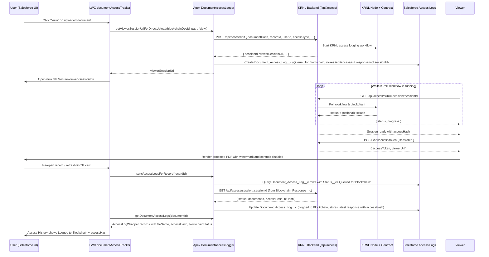

## KRNL Document Access & Compliance Setup

This project includes a KRNL-backed document access and compliance flow that spans:

- Salesforce LWCs and Apex classes.
- A Node.js backend (this repo's `backend/` folder).
- On-chain logging via KRNL and a smart contract.

Use this section as a quick checklist to get a new scratch org + backend wired up.

### 1. Backend `.env` configuration

In `backend/.env`, configure the following variables:

#### Required variables

**Server / auth**
- `NODE_ENV=production` (or `development`)
- `PORT=3000`
- `PUBLIC_BASE_URL=https://<your-ngrok-or-deployed-url>`
- `JWT_SECRET=<strong-random-string>`

**KRNL / blockchain**
- `KRNL_NODE_URL=https://node.krnl.xyz`
- `MOCK_KRNL=false` (set `true` for testing with mocks)
- `DOCUMENT_REGISTRY_CONTRACT=0x<contract-address>`
- `SENDER_ADDRESS=0x<smart-account-address>`
- `TARGET_CONTRACT_OWNER=0x<delegate-address>` (usually same as `SENDER_ADDRESS`)
- `ATTESTOR_ADDRESS=image://docker.io/<your-attestor-image>:tag`
- `RPC_SEPOLIA_URL=https://ethereum-sepolia-rpc.publicnode.com`

**EIP-4337 smart account**
- `ENABLE_EIP4337_INIT=true`
- `FACTORY_ADDRESS=0x<factory-contract-address>`
- `APP_SECRET=<secret-for-smart-account-salt>`
- `EOA_PRIVATE_KEY=0x<eoa-private-key>`

**Supabase (session persistence)**
- `SUPABASE_URL=https://<project>.supabase.co`
- `SUPABASE_SERVICE_KEY=<service-role-key>`
- `KRNL_SESSION_TABLE=krnl_sessions`

**Supabase Storage (S3-compatible)**
- `SUPABASE_S3_ENDPOINT=https://<project>.supabase.co/storage/v1/s3`
- `SUPABASE_S3_REGION=<region>` (e.g., `ap-southeast-2`)
- `SUPABASE_S3_ACCESS_KEY_ID=<s3-access-key>`
- `SUPABASE_S3_SECRET_ACCESS_KEY=<s3-secret-key>`
- `SUPABASE_BUCKET=documents`

**Viewer / tokens**
- `VIEWER_TOKEN_TTL_SECONDS=3600` (viewer token expiry in seconds)

#### Optional variables

- `LOG_LEVEL=debug` (or `info`, `warn`, `error`)
- `LOG_FILE_PATH=./logs/app.log`
- `KRNL_POLL_TIMEOUT_MS=60000` (KRNL workflow polling timeout)
- `MAX_FILE_UPLOAD_BYTES=10485760` (max upload size in bytes)
- `UPLOAD_TOKEN_TTL_SECONDS=900` (upload token expiry)
- `VIEWER_URL_TTL_SECONDS=3600` (signed URL expiry)
- `SALESFORCE_INSTANCE_URL=https://<instance>.my.salesforce.com` (optional override)
- `SALESFORCE_ACCESS_TOKEN=<token>` (optional override)
- `SALESFORCE_API_VERSION=v60.0`

Then start the backend:

```bash
cd backend
npm install
npm start
```

If you use ngrok, expose the port and update `PUBLIC_BASE_URL` to the ngrok HTTPS URL.

### 2. Salesforce Named Credential

The Apex class `DocumentAccessLogger` uses a Named Credential called `krnl_blockchain_endpoint`:

```apex
private static final String BLOCKCHAIN_ENDPOINT = 'krnl_blockchain_endpoint';
```

Create a **Named Credential (Legacy)** in Setup:

- **Name**: `krnl_blockchain_endpoint`
- **URL**: `https://<your-ngrok-or-deployed-url>` (matches `PUBLIC_BASE_URL`)
- **Identity Type**: Named Principal
- **Authentication Protocol**: No Authentication

This is used for all Apex callouts to the backend, including:

- `/api/uploads/init` (direct uploads)
- `/api/access` and `/api/access/init` (access logging)
- `/api/files/viewer-url` (signed viewer URLs)
- `/api/compliance` and `/api/documents/register-direct` (registration/compliance)

### 3. CSP Trusted Site for LWC `fetch`

The `directUploadToBackend` LWC uploads files via `fetch(uploadUrl, { method: 'PUT', ... })`.

In **Setup → CSP Trusted Sites**:

- New Trusted Site:
  - **Trusted Site Name**: `KRNL_Backend`
  - **Trusted Site URL**: `https://<your-ngrok-or-deployed-url>`
  - Enable **Connect-src** (so LWC JavaScript can call the backend).

Use the same base URL as `PUBLIC_BASE_URL` and the Named Credential.

### 4. Deploy Salesforce metadata to a scratch org

From the `salesforce-krnl/salesforce-krnl` folder:

```bash
sf org create scratch \
  --definition-file config/project-scratch-def.json \
  --alias scratchOrg \
  --duration-days 7 \
  --set-default \
  --target-dev-hub <your-dev-hub-alias-or-username>

sf project deploy start \
  --source-dir force-app/main/default \
  --target-org scratchOrg
```

### 5. Place KRNL components on record pages

**Main KRNL card** – `documentAccessTracker` LWC:

- Exposed to `lightning__RecordPage`, `lightning__AppPage`, `lightning__HomePage`, and `lightning__Tab`.
- Shows:
  - Direct upload section (`directUploadToBackend` nested inside).
  - Uploaded Files for this Record (from `Blockchain_Document__c`).
  - Access History (from `Document_Access_Log__c`).

To add it to an object record page:

1. Go to **Setup → Object Manager → <Object> → Lightning Record Pages**.
2. Edit (or create) a record page.
3. In Lightning App Builder, drag **Document Access Tracker** onto the layout.
4. Save and Activate.

**Standalone upload** – `directUploadToBackend` LWC:

- Also available as a separate component if you want just the upload area on a page.

### 6. Apex classes involved

- `DocumentAccessLogger`
  - Handles direct uploads, viewer URLs, access logging, blockchain registration.
  - Performs callouts to the backend using `krnl_blockchain_endpoint`.
- `DocumentAccessController`
  - Provides LWC data:
    - Compliance stats (`getComplianceStats`).
    - Recent activity (`getRecentActivity`).
    - Per-record uploads (`getUploadsForRecord`).
    - Per-record access logs (`getDocumentAccessLogs`).

### 7. Backend endpoints (quick reference)

- `/api/uploads/init` – start a direct upload session from Apex.
- `/api/uploads/:uploadId/file` – LWC binary upload using signed URL.
- `/api/files/viewer-url` – signed Supabase/S3 file URL.
- `/api/access` – synchronous access logging that returns a ready-to-use viewer URL.
- `/api/access/init` – **session-first** access logging; starts a KRNL workflow and returns a `sessionId` + `viewerSessionUrl`.
- `/api/access/session/:sessionId` – Salesforce-authenticated session status (used by Apex to sync access logs).
- `/api/access/public-session/:sessionId` – public session status (used by the secure viewer tab for polling).
- `/api/access/token` – returns a signed viewer token once a session has completed on-chain.
- `/api/view` – secure PDF/asset viewer used by the KRNL HTML viewer.
- `/api/compliance` and `/api/documents/register-direct` – document registration/compliance.

With these pieces configured, a new scratch org + running backend can:

- Upload files directly to Supabase/S3 via LWC.
- Register documents on-chain via KRNL.
- Log access events and show them in the record-level KRNL card.

### 8. Session-first secure viewer & access history (architecture)

The **session-first** flow opens the secure viewer immediately in a new tab, while KRNL and the
blockchain workflow run in the background. Salesforce later pulls the final `accessHash` and
blockchain status using the KRNL `sessionId`.

#### Components

- **LWC `documentAccessTracker`**
  - Shows direct uploads, access history, and opens the secure viewer.
- **Apex `DocumentAccessLogger`**
  - Starts access logging via `/api/access/init` and creates `Document_Access_Log__c` rows.
- **Apex `DocumentAccessController`**
  - Provides access history to LWCs and exposes `syncAccessLogsForRecord` to refresh queued logs.
- **Node backend (`backend/`)**
  - Orchestrates KRNL workflows, tracks in-memory sessions, and serves the HTML secure viewer.
- **KRNL node + `DocumentAccessRegistry` contract**
  - Executes the access logging workflow and emits `DocumentAccessLogged` events containing
    `documentId` and `accessHash`.
- **Salesforce objects**
  - `Blockchain_Document__c` – registered documents.
  - `Document_Access_Log__c` – per-access audit records shown in Access History.

#### End-to-end flow (session-first viewer)



#### Notes and limitations

- **Session persistence**: The backend still tracks sessions in an in-memory `Map`, but also mirrors
  them to Supabase Postgres (default `krnl_sessions` table) via `sessionStore.js`. `getWorkflowStatus`
  can hydrate sessions from Supabase after a restart. Viewer tokens expire after
  `VIEWER_TOKEN_TTL_SECONDS`, and a scheduled Supabase Edge Function can delete rows where
  `expires_at < now()`.
- **No backend→Salesforce writes**: The backend never calls Salesforce directly. All updates to
  `Document_Access_Log__c` are performed by Apex (`syncAccessLogsForRecord` / `syncSingleAccessLog`).
- **Multi-org friendly**: Each org only needs the `krnl_blockchain_endpoint` Named Credential and
  CSP Trusted Site. There is no org-specific token stored in the backend `.env` for the
  session-first flow.
